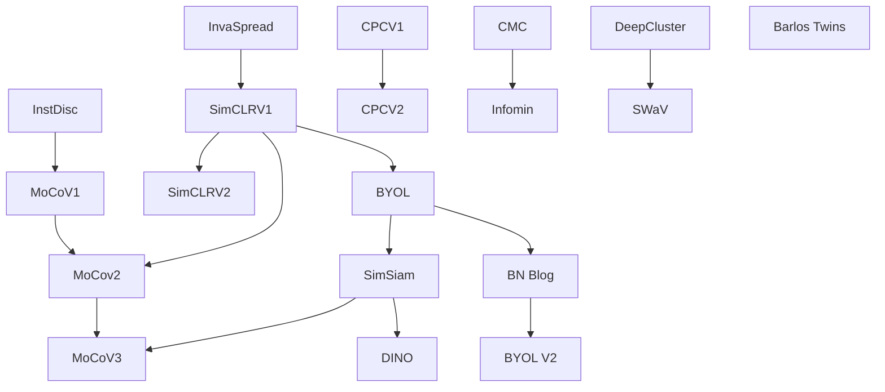

## 1.百花齐放

### Unsupervised Feature Learning via Non-Parametric Instance-level Discrimination (InstDisc)

Neural net classifiers trained on data with annotated class labels can also capture apparent visual similarity among categories without being directed to do so. We study whether this observation can be extended beyond the conventional domain of supervised learning: Can we learn a good feature representation that captures apparent similarity among instances, instead of classes, by merely asking the feature to be discriminative of individual instances? We formulate this intuition as a non-parametric classification problem at the instance-level, and use noise-contrastive estimation to tackle the computational challenges imposed by the large number of instance classes. Our experimental results demonstrate that, under unsupervised learning settings, our method surpasses the state-of-the-art on ImageNet classification by a large margin. Our method is also remarkable for consistently improving test performance with more training data and better network architectures. By fine-tuning the learned feature, we further obtain competitive results for semi-supervised learning and object detection tasks. Our non-parametric model is highly compact: With 128 features per image, our method requires only 600MB storage for a million images, enabling fast nearest neighbour retrieval at the run time.

- 提出了代理任务
- memory bank提出

Figure 1: Supervised learning results that motivate our unsupervised approach. For an image from class leopard, the classes that get highest responses from a trained neural net classifier are all visually correlated, e.g., jaguar and cheetah. It is not the semantic labeling, but the apparent similarity in the data themselves that brings some classes closer than others. Our unsupervised approach takes the class-wise supervision to the extreme and learns a feature representation that discriminates among individual instances.

图 1：激励我们的无监督方法的监督学习结果。 对于来自豹类的图像，从经过训练的神经网络分类器中获得最高结果的类都是视觉相关的，例如美洲虎和猎豹。 不是语义标签，而是数据本身的明显相似性使某些类比其他类更接近。 我们的无监督方法将分类监督发挥到了极致，并学习了一种区分个体实例的特征表示。

Figure 2: The pipeline of our unsupervised feature learning approach. We use a backbone CNN to encode each image as a feature vector, which is projected to a 128-dimensional space and L2 normalized. The optimal feature embedding is learned via instance-level discrimination, which tries to maximally scatter the features of training samples over the 128-dimensional unit sphere.

图 2：我们的无监督特征学习方法的流程。 我们使用主干 CNN 将每个图像编码为特征向量，将其投影到 128 维空间并进行 L2 归一化。 最佳特征嵌入是通过实例级别的判别来学习的，它试图将训练样本的特征最大程度地分散在 128 维单位球面上。

### Unsupervised Embedding Learning via Invariant and Spreading Instance Feature (InvaSpread)

This paper studies the unsupervised embedding learning problem, which requires an effective similarity measurement between samples in low-dimensional embedding space. Motivated by the positive concentrated and negative separated properties observed from category-wise supervised learning, we propose to utilize the instance-wise supervision to approximate these properties, which aims at learning data augmentation invariant and instance spread-out features. To achieve this goal, we propose a novel instance based softmax embedding method, which directly optimizes the `real' instance features on top of the softmax function. It achieves significantly faster learning speed and higher accuracy than all existing methods. The proposed method performs well for both seen and unseen testing categories with cosine similarity. It also achieves competitive performance even without pre-trained network over samples from fine-grained categories.

- SimCLR前身
- 没有使用额外的数据结构存储大量的负样本
- 它的正负样本来自于同一个minibatch
- 只使用一个编码器，做端到端学习

Figure 1: Illustration of our basic idea. The features of the same instance under different data augmentations should be invariant, while features of different image instances should be separated.
图 1：我们基本想法的说明。 同一实例在不同数据增强下的特征应该是不变的，而不同图像实例的特征应该是分开的。

Figure 2: The framework of the proposed unsupervised learning method with Siamese network. The input images are projected into low-dimensional normalized embedding features with the CNN backbone. Image features of the same image instance with different data augmentations are invariant, while embedding features of different image instances are spread-out.
图 2：所提出的具有连体网络的无监督学习方法的框架。 输入图像通过 CNN 主干投影到低维归一化嵌入特征中。 具有不同数据增强的同一图像实例的图像特征是不变的，而不同图像实例的嵌入特征是分散的。

### Representation Learning with Contrastive Predictive Coding (CPC)

While supervised learning has enabled great progress in many applications, unsupervised learning has not seen such widespread adoption, and remains an important and challenging endeavor for artificial intelligence. In this work, we propose a universal unsupervised learning approach to extract useful representations from high-dimensional data, which we call Contrastive Predictive Coding. The key insight of our model is to learn such representations by predicting the future in latent space by using powerful autoregressive models. We use a probabilistic contrastive loss which induces the latent space to capture information that is maximally useful to predict future samples. It also makes the model tractable by using negative sampling. While most prior work has focused on evaluating representations for a particular modality, we demonstrate that our approach is able to learn useful representations achieving strong performance on four distinct domains: speech, images, text and reinforcement learning in 3D environments.

- 泛用性广
- 用预测来实现代理任务

Figure 1: Overview of Contrastive Predictive Coding, the proposed representation learning approach.Although this figure shows audio as input, we use the same setup for images, text and reinforcementlearning.
图 1：对比预测编码概述，提出的表示学习方法。尽管此图显示音频作为输入，但我们对图像、文本和强化学习使用相同的设置。

### Contrastive Multiview Coding (CMC)

Humans view the world through many sensory channels, e.g., the long-wavelength light channel, viewed by the left eye, or the high-frequency vibrations channel, heard by the right ear. Each view is noisy and incomplete, but important factors, such as physics, geometry, and semantics, tend to be shared between all views (e.g., a "dog" can be seen, heard, and felt). We investigate the classic hypothesis that a powerful representation is one that models view-invariant factors. We study this hypothesis under the framework of multiview contrastive learning, where we learn a representation that aims to maximize mutual information between different views of the same scene but is otherwise compact. Our approach scales to any number of views, and is view-agnostic. We analyze key properties of the approach that make it work, finding that the contrastive loss outperforms a popular alternative based on cross-view prediction, and that the more views we learn from, the better the resulting representation captures underlying scene semantics. Our approach achieves state-of-the-art results on image and video unsupervised learning benchmarks. Code is released at: this http URL.

人类通过许多传感器来观察世界，例如左眼看到的长波长光通道或右耳听到的高频振动通道。每个视图都是带有噪声的且不完整的，但重要的因素，如物理性质、几何和语义，往往在所有视图之间共享（例如，可以看到、听到和感觉到“狗”）。我们研究了一个经典假设，即强大的表示是对视图不变因素进行建模的表示。我们在多视图对比学习的框架下研究了这个假设，我们学习了一种表示，旨在最大化同一场景的不同视图之间的互信息，但在其他方面是紧凑的。我们的方法可以扩展到任意数量的视图，并且与视图无关。我们分析了使其工作的方法的关键属性，发现对比损失优于基于跨视图预测的流行替代方法，并且我们学习的视图越多，生成的表示就越能捕捉到潜在的场景语义。我们的方法在图像和视频无监督学习基准上取得了最先进的结果。代码发布于：this http URL。

- 一个物体的很多视角都可以视为正样本
- 通过蒸馏的方式，teacher是正样本，student是负样本
- 缺点，不同的模态可能需要不同的编码器。

Figure 1: Given a set of sensory views, a deep representation is learnt by bringing views of the *same* scene together in embedding space, while pushing views of *different scenes* apart. Here we show and example of a 4-view dataset (NYU RGBD [53]) and its learned representation. The encodings for each view may be concatenated to form the full representation of a scene.
图 1：给定一组感官视图，通过将*相同*场景的视图放在嵌入空间中，同时将*不同场景*的视图分开，从而学习深度表示。 在这里，我们展示了一个 4 视图数据集（NYU RGBD [53]）及其学习表示的示例【四个视角：原始的图像、图像的深度信息、SwAV ace normal、分割图像】。 每个视图的编码可以连接起来形成一个场景的完整表示。

## 2. CV双雄

### Momentum Contrast for Unsupervised Visual Representation Learning（MoCo）

*We present Momentum Contrast (MoCo) for unsupervised visual representation learning. From a perspective on contrastive learning [29] as dictionary look-up, we build a dynamic dictionary with a queue and a moving-averaged encoder. This enables building a large and consistent dictionary on-the-fly that facilitates contrastive unsupervised learning. MoCo provides competitive results under the common linear protocol on ImageNet classification. More importantly, the representations learned by MoCo transfer well to downstream tasks. MoCo can **outperform** its supervised pre-training counterpart in 7 detection/segmentation tasks on PASCAL VOC, COCO, and other datasets, sometimes surpassing it by large margins. This suggests that the gap between unsupervised and supervised representation learning has been largely closed in many vision tasks.*

*我们提出了用于无监督视觉表征学习的 Momentum Contrast (MoCo)。 从对比学习 [29] 作为字典查询的角度来看，我们构建了一个带有队列【放到队列中样本不需要要进行梯度回传，可以放入大量的负样本】和移动平均编码器【使得字典比较的一致】的动态字典。 这使得能够即时构建一个大型且一致的字典，以促进对比无监督学习。 MoCo 在 ImageNet 分类的通用线性协议【预训练好骨干网络在处理任务时冻住，只调整最后的全连接层，把预训练好模型当特征提取器，来证明其学习表示的特征到底好不好】下提供有竞争力的结果。 更重要的是，MoCo 学习的表示可以很好地迁移到下游任务。 在 PASCAL VOC、COCO 和其他数据集上的 7 个检测/分割任务中，MoCo 可以**胜过**它的监督预训练对手，有时甚至会大大超过它。 这表明在许多视觉任务中，无监督和有监督表示学习之间的差距已基本缩小。*

- 主要贡献：将之前的代理方法归纳为字典查找，提出了队列和动量编码器

### A Simple Framework for Contrastive Learning of Visual Representations (SimCLRv1)

This paper presents SimCLR: a simple framework for contrastive learning of visual representations. We simplify recently proposed contrastive self-supervised learning algorithms without requiring specialized architectures or a memory bank. In order to understand what enables the contrastive prediction tasks to learn useful representations, we systematically study the major components of our framework. We show that (1) composition of data augmentations plays a critical role in defining effective predictive tasks, (2) introducing a learnable nonlinear transformation between the representation and the contrastive loss substantially improves the quality of the learned representations, and (3) contrastive learning benefits from larger batch sizes and more training steps compared to supervised learning. By combining these findings, we are able to considerably outperform previous methods for self-supervised and semi-supervised learning on ImageNet. A linear classifier trained on self-supervised representations learned by SimCLR achieves 76.5% top-1 accuracy, which is a 7% relative improvement over previous state-of-the-art, matching the performance of a supervised ResNet-50. When fine-tuned on only 1% of the labels, we achieve 85.8% top-5 accuracy, outperforming AlexNet with 100X fewer labels. 

Figure 2. A simple framework for contrastive learning of visual representations. Two separate data augmentation operators are sampled from the same family of augmentations ($t \sim \mathcal{T}$ and $t' \sim \mathcal{T}$) and applied to each data example to obtain two correlated views. A base encoder network $f(\cdot)$ and a projection head $g(\cdot)$ are trained to maximize agreement using a contrastive loss. After training is completed, we throw away the projection head $g(\cdot)$ and use encoder $f(\cdot)$ and representation $\mathbb{h}$ for downstream tasks.

- 在编码器后面添加了一个全连接层，且只在训练的时候使用
- 贡献：更多的数据增强
- 贡献：非线性变换，即在编码器后面添加了一个全连接层

### Improved Baselines with Momentum Contrastive Learning (MoCo v2)

Contrastive unsupervised learning has recently shown encouraging progress, e.g., in Momentum Contrast (MoCo) and SimCLR. In this note, we verify the effectiveness of two of SimCLR’s design improvements by implementing them in the MoCo framework. With simple modifications to MoCo—namely, using an MLP projection head and more data augmentation—we establish stronger baselines that outperform SimCLR and do not require large training batches. We hope this will make state-of-the-art unsupervised learning research more accessible. Code will be made public.

Table 1. **Ablation of MoCo baselines**, evaluated by ResNet-50 for (i) ImageNet linear classification, and (ii) fine-tuning VOC object detection (mean of 5 trials). **“MLP”**: with an MLP head; **“aug+”**: with extra blur augmentation; **“cos”**: cosine learning rate schedule.

### Big Self-Supervised Models are Strong Semi-Supervised Learners (SimCLR v2)

One paradigm for learning from few labeled examples while making best use of a large amount of unlabeled data is unsupervised pretraining followed by supervised fine-tuning. Although this paradigm uses unlabeled data in a task-agnostic way, in contrast to common approaches to semi-supervised learning for computer vision, we show that it is surprisingly effective for semi-supervised learning on ImageNet. A key ingredient of our approach is the use of big (deep and wide) networks during pretraining and fine-tuning. We find that, the fewer the labels, the more this approach (task-agnostic use of unlabeled data) benefits from a bigger network. After fine-tuning, the big network can be further improved and distilled into a much smaller one with little loss in classification accuracy by using the unlabeled examples for a second time, but in a task-specific way. The proposed semi-supervised learning algorithm can be summarized in three steps: unsupervised pretraining of a big ResNet model using SimCLRv2, supervised fine-tuning on a few labeled examples, and distillation with unlabeled examples for refining and transferring the task-specific knowledge. This procedure achieves 73.9% ImageNet top-1 accuracy with just 1% of the labels (≤13 labeled images per class) using ResNet-50, a 10× improvement in label efficiency over the previous state-of-the-art. With 10% of labels, ResNet-50 trained with our method achieves 77.5% top-1 accuracy, outperforming standard supervised training with all of the labels. $^1$

在充分利用大量未标记数据的同时，从少数标记示例中学习的一个范例是无监督的预训练，然后是有监督的微调。我们的方法的一个关键要素是在预训练和微调期间使用大（深度和广度）的网络。 我们发现，标签越少，这种方法（task-agnostic use of unlabeled data）从更大的网络中获益越多。在微调之后，通过第二次使用未标记的示例，可以进一步改进大网络，并将其蒸馏为更小的网络，但分类精度损失很小，but in atask-specificway.

- 非常大的自监督训练出来的模型适合用来做半监督学习

Figure 3: The proposed semi-supervised learning framework leverages unlabeled data in two ways:(1) task-agnostic use in unsupervised pretraining, and (2) task-specific use in self-training / distillation.
- 如何自监督的训练一个大的模型，只需要一小部分的有监督的训练进行微调，然后微调一旦结束就可以将其视为一个teacher模型，用其生成许多伪标签来在更多的无标签的模型上进行自学习了。
- 受google的noise student的工作的启发
- SimClRv1变成v2
  - 换用了一个更大的模型
  - mlp层数提高，变成两层
  - 使用动量编码器

### Unsupervised Learning of Visual Features by Contrasting Cluster Assignments (SWaV)

Unsupervised image representations have significantly reduced the gap with supervised pretraining, notably with the recent achievements of contrastive learning methods. These contrastive methods typically work online and rely on a large number of explicit pairwise feature comparisons, which is computationally challenging. In this paper, we propose an online algorithm, SwAV, that takes advantage of contrastive methods without requiring to compute pairwise comparisons. Specifically, our method simultaneously clusters the data while enforcing consistency between cluster assignments produced for different augmentations (or views) of the same image, instead of comparing features directly as in contrastive learning. Simply put, we use a swapped prediction mechanism where we predict the code of a view from the representation of another view. Our method can be trained with large and small batches and can scale to unlimited amounts of data. Compared to previous contrastive methods, our method is more memory efficient since it does not require a large memory bank or a special momentum network. In addition, we also propose a new data augmentation strategy, multi-crop, that uses a mix of views with different resolutions in place of two full-resolution views, without increasing the memory or compute requirements. We validate our findings by achieving 75.3% top-1 accuracy on ImageNet with ResNet-50, as well as surpassing supervised pretraining on all the considered transfer tasks.

现在大多数对比学习的方法都是在线学习且依赖于大量的样本对，这造成了比较打得计算负担。在这篇文章中，作者提出了一种在线学习算法，它不依赖与成对地比较。这个方法对数据进行聚类，同时确保同一图像的不同增强(或“视图”)产生的聚类分配之间的一致性。不像对比学习那样直接去比较特征。使用一种交换预测机制，从一个视图的表示去预测另一个视图。提出了一种新的数据增强的策略：multi-crop，使用不同分辨率的视图的混合去替换两个全分辨率的视图，这有利于减小计算量。

- 对比学习+聚类

Figure 1: **Contrastive instance learning (left) vs. SwAV (right).** In contrastive learning methods applied to instance classification, the features from different transformations of the same images are compared directly to each other. In SwAV, we first obtain “codes” by assigning features to prototype vectors. We then solve a “swapped” prediction problem wherein the codes obtained from one data augmented view are predicted using the other view. Thus, SwAV does not directly compare image features. Prototype vectors are learned along with the ConvNet parameters by backpropragation.

- 与聚类中心相比，而不是与大量的负样本进行相比
- 聚类中心的个数比负样本要小很多
- 聚类中心有明确的含义

>相关论文：
>
>1. deep cluster
>2. deep cluster2

- trick: Multi-crop
    - 之前的做法是在一张大图片中取两个部分当作crop，现在的方法是用多个crop【裁剪】，但是现在使用比之前小的crop和更多的更小的crop
    - 思想：要关注全局的和局部的思想

> informing
> **What Makes for Good Views for Contrastive Learning?**
> Contrastive learning between multiple views of the data has recently achieved state of the art performance in the field of self-supervised representation learning. Despite its success, the influence of different view choices has been less studied. In this paper, we use theoretical and empirical analysis to better understand the importance of view selection, and argue that we should reduce the mutual information (MI) between views while keeping task-relevant information intact. To verify this hypothesis, we devise unsupervised and semi-supervised frameworks that learn effective views by aiming to reduce their MI. We also consider data augmentation as a way to reduce MI, and show that increasing data augmentation indeed leads to decreasing MI and improves downstream classification accuracy. As a by-product, we achieve a new state-of-the-art accuracy on unsupervised pre-training for ImageNet classification (73% top-1 linear readout with a ResNet-50). In addition, transferring our models to PASCAL VOC object detection and COCO instance segmentation consistently outperforms supervised pre-training. Code:this [http URL](https://github.com/HobbitLong/PyContrast)
>
> - 到底选择什么视角对对比学习好
>   - 互信息(Mutual Information)是信息论里一种有用的信息度量，它可以看成是一个随机变量中包含的关于另一个随机变量的信息量，或者说是一个随机变量由于已知另一个随机变量而减少的不肯定性。
>   - 最小化互信息InForMin:minimi mutual information:不多不少的互信息

### Summary

- 目标函数趋于统一:inforNCE之类的函数
- 模型：编码器+projection head实现
- 使用动量编码器
- 训练的更久

## 3.不用负样本

### Bootstrap Your Own Latent A New Approach to Self-Supervised Learning

We introduce Bootstrap Your Own Latent (BYOL), a new approach to self-supervised image representation learning. BYOL relies on two neural networks, referred to as online and target networks, that interact and learn from each other. From an augmented view of an image, we train the online network to predict the target network representation of the same image under a different augmented view. At the same time, we update the target network with a slow-moving average of the online network. While state-of-the art methods intrinsically rely on negative pairs, BYOL achieves a new state of the art without them. BYOL reaches 74.3% top-1 classification accuracy on ImageNet using the standard linear evaluation protocol with a standard ResNet-50 architecture and 79.6% with a larger ResNet. We also show that BYOL performs on par or better than the current state of the art on both transfer and semi-supervised benchmarks.

Figure 2: BYOL’s architecture. BYOL minimizes a similarity loss between $q_θ(z_θ)$ and ${\rm sg}(z'_ξ)$, where $θ$ are the trained weights, $ξ$ are an exponential moving average of $θ$ and $\rm sg$ means stop-gradient. At the end of training, everything but $f_θ$ is discarded, and $y_θ$ is used as the image representation.

- 通过一个视角的特征去预测另外一个视角的特征
- 目标函数：mse

### Understanding self-supervised and contrastive learning with "Bootstrap Your Own Latent"(BYOL)

https://generallyintelligent.ai/blog/2020-08-24-understanding-self-supervised-contrastive-learning/

#### **Summary**

Unlike prior work like SimCLR and MoCo, the recent paper Bootstrap Your Own Latent (BYOL) from DeepMind demonstrates a state of the art method for self-supervised learning of image representations without an explicitly contrastive loss function. This simplifies training by removing the need for negative examples in the loss function. We highlight two surprising findings from our work on reproducing BYOL:
(1) BYOL often performs no better than random when batch normalization is removed, and

(2) the presence of batch normalization implicitly causes a form of contrastive learning.

These findings highlight the importance of contrast between positive and negative examples when learning representations and help us gain a more fundamental understanding of how and why self-supervised learning works.

The code used for this post can be found at https://github.com/untitled-ai/self_supervised.

- 这篇blog作者认为projection head中的BN层【batch norm】起到了很重要的作用,认为这个操作里有信息泄露，正样本是和平均图片做对比，是一种隐式的对比学习。

### BYOL works even without batch statistics

Bootstrap Your Own Latent (BYOL) is a self-supervised learning approach for image representation. From an augmented view of an image, BYOL trains an online network to predict a target network representation of a different augmented view of the same image. Unlike contrastive methods, BYOL does not explicitly use a repulsion term built from negative pairs in its training objective. Yet, it avoids collapse to a trivial, constant representation. Thus, it has recently been hypothesized that batch normalization (BN) is critical to prevent collapse in BYOL. Indeed, BN flows gradients across batch elements, and could leak information about negative views in the batch, which could act as an implicit negative (contrastive) term. However, we experimentally show that replacing BN with a batch-independent normalization scheme (namely, a combination of group normalization and weight standardization) achieves performance comparable to vanilla BYOL (73.9% vs. 74.3% top-1 accuracy under the linear evaluation protocol on ImageNet with ResNet-50). Our finding disproves the hypothesis that the use of batch statistics is a crucial ingredient for BYOL to learn useful representations.

- 证明了BN层在BYOL不是提供隐式的对比学习
- BN层是提供模型的稳健性，防止模型坍塌

### Exploring Simple Siamese Representation Learning （SimSiam）

Siamese networks have become a common structure in various recent models for unsupervised visual representation learning. These models maximize the similarity between two augmentations of one image, subject to certain conditions for avoiding collapsing solutions. In this paper, we report surprising empirical results that simple Siamese networks can learn meaningful representations even using none of the following: (i) negative sample pairs, (ii) large batches, (iii) momentum encoders. Our experiments show that collapsing solutions do exist for the loss and structure, but a stop-gradient operation plays an essential role in preventing collapsing. We provide a hypothesis on the implication of stop-gradient, and further show proof-of-concept experiments verifying it. Our "SimSiam" method achieves competitive results on ImageNet and downstream tasks. We hope this simple baseline will motivate people to rethink the roles of Siamese architectures for unsupervised representation learning. Code will be made available.

- 不用负样本
- 不用大的batchsize
- 不用动量编码器

Figure 1. SimSiam architecture. Two augmented views of one image are processed by the same encoder network f (a backbone plus a projection MLP). Then a prediction MLP h is applied on one side, and a stop-gradient operation is applied on the other side. The model maximizes the similarity between both sides. It uses neither negative pairs nor a momentum encoder.

- 结论：因为有stop gradient存在，所以可以正常训练，可以视为一个EM算法
- 可以理解为一个k-means的聚类问题【】

Figure 3. **Comparison on Siamese architectures.** The encoder includes all layers that can be shared between both branches. The dash lines indicate the gradient propagation flow. In BYOL,SwAV, and SimSiam, the lack of a dash line implies stop-gradient, and their symmetrization is not illustrated for simplicity. The components in red are those missing in SimSiam.

> Barlos Twins：更换了目标函数，生成了一个关联矩阵【cross correlation matrix】，希望这个矩阵和identity matrix相似【单位矩阵】，希望正样本与自己相似性接近1，与其他的样本相似性接近0

## 4.Transformer

### An Empirical Study of Training Self-Supervised Vision Transformers（MoCoV3）

This paper does not describe a novel method. Instead, it studies a straightforward, incremental, yet must-know baseline given the recent progress in computer vision: self-supervised learning for Vision Transformers (ViT). While the training recipes for standard convolutional networks have been highly mature and robust, the recipes for ViT are yet to be built, especially in the self-supervised scenarios where training becomes more challenging. In this work, we go back to basics and investigate the effects of several fundamental components for training self-supervised ViT. We observe that instability is a major issue that degrades accuracy, and it can be hidden by apparently good results. We reveal that these results are indeed partial failure, and they can be improved when training is made more stable. We benchmark ViT results in MoCo v3 and several other self-supervised frameworks, with ablations in various aspects. We discuss the currently positive evidence as well as challenges and open questions. We hope that this work will provide useful data points and experience for future research.

这篇论文没有描述一种新的方法。相反，鉴于计算机视觉的最新进展，它研究了一个简单的、增量的但必须知道的基线：视觉变形金刚 (ViT) 的自我监督学习。虽然标准卷积网络的训练方法已经非常成熟和强大，但 ViT 的方法尚未建立，尤其是在训练变得更具挑战性的自我监督场景中。在这项工作中，我们回到基础并研究几个基本组件对训练自我监督 ViT 的影响。我们观察到不稳定性是降低准确性的一个主要问题，并且可以通过明显好的结果来隐藏。我们发现这些结果确实是部分失败的，当训练更加稳定时，它们可以得到改善。我们在 MoCo v3 和其他几个自我监督框架中对 ViT 结果进行了基准测试，并在各个方面进行了消融。我们讨论了当前的积极证据以及挑战和未解决的问题。我们希望这项工作能为未来的研究提供有用的数据点和经验。

<!---算法--->

> 每次训练出现较大波动时，第一层的梯度也会出现较大的波峰，解决方法：冻住第一层就可以了
> 证明了第一层tokenization的重要性

### Emerging Properties in Self-Supervised Vision Transformers (DINO)

In this paper, we question if self-supervised learning provides new properties to Vision Transformer (ViT) that stand out compared to convolutional networks (convnets). Beyond the fact that adapting self-supervised methods to this architecture works particularly well, we make the following observations: first, self-supervised ViT features contain explicit information about the semantic segmentation of an image, which does not emerge as clearly with supervised ViTs, nor with convnets. Second, these features are also excellent k-NN classifiers, reaching 78.3% top-1 on ImageNet with a small ViT. Our study also underlines the importance of momentum encoder, multi-crop training, and the use of small patches with ViTs. We implement our findings into a simple self-supervised method, called DINO, which we interpret as a form of self-distillation with no labels. We show the synergy between DINO and ViTs by achieving 80.1% top-1 on ImageNet in linear evaluation with ViT-Base.

- 一个不用任何标签训练的vit的自注意图可视化后能发现每个物体的轮廓

Figure 2: **Self-distillation with no labels.** We illustrate DINO in the case of one single pair of views (x1, x2) for simplicity. The model passes two different random transformations of an input image to the student and teacher networks. Both networks have the same architecture but different parameters. The output of the teacher network is centered with a mean computed over the batch. Each networks outputs a K dimensional feature that is normalized with a temperature softmax over the feature dimension. Their similarity is then measured with a cross-entropy loss. We apply a stop-gradient (sg) operator on the teacher to propagate gradients only through the student. The teacher parameters are updated with an exponential moving average (ema) of the student parameters.

## Summary

InstDisc:

- 个体判别的任务
- memory bank存储负样本

InvaSpread

- 端到端的学习
- 一个编码器
- batchsize太小，效果不够好

CPC V1

- 提出了infoNCE loss
- 预测性代理任务

CMC

- 引入了多个视角

DeepCluster

- 基于基类学习

MoCO V1

- 动量编码器以及队列
- 使用外部数据结构
- 视角上第一个无监督比有监督好

SimCLR V1

- 更多的数据增强
- 非线性变换[projection head]，即在编码器后面添加了一个全连接层
- 更大的batchsize

CPC V2

- 使用了上述提到的改进

CMC

- 分析结果
- 提出了infomin的原则：两个样本或者两个视角的互信息要不多不少

MoCo v2

- 使用了SimCLR v1 的数据增强和projection head

SimCLR v2

- 半监督学习

SWaV

- 对比学习+聚类学习
- 主要来自multi-crop的技术

BYOL

- 无负样本
- 自己学自己，对比任务变对比任务
- 损失函数变MSE

BN Blog

- 说BYOL能学习主要是因为有batch norm
- batch norm 提供隐式负样本、

BYOL V2

- batch norm只是帮助了模型的训练

SimSiam

- 总结之前的工作 
- 提出孪生网络
- 不需要大的batchsize、动量编码器、负样本
- stop gradinet 至关重要，可以视为EM算法，通过逐步更新避免模型坍塌

Barlos Twins

- 更换了损失函数
- 变成矩阵的相似性、

MoCo V3& DINO

- 主干网络换成Transformer
- MoCo 冻住第一层
- DINO teacher网络进行归一
